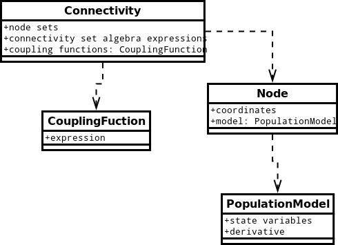

tvbml
=====

The Virtual Brain Markup Language: the aim is to develop XML schema for description of population-based simulations. 

Very basic sketch of population model components, intentionally simple to provoke feedback:

